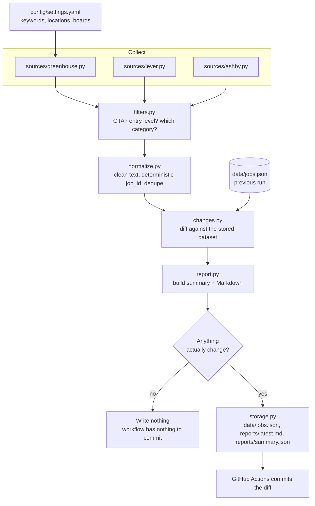

# Toronto Tech Job Intelligence Tracker

A small Python project that checks public job-board APIs once a day, keeps a
normalized dataset of **entry-level technology roles in Toronto and the GTA**,
and regenerates a Markdown report whenever the listings actually change.

[](https://github.com/IliyaEbadi/Tech-Job-Tracker/actions/workflows/ci.yml)
[](https://github.com/IliyaEbadi/Tech-Job-Tracker/actions/workflows/daily.yml)

**Latest output lives in [`reports/latest.md`](reports/latest.md)** and the raw
dataset in [`data/jobs.json`](data/jobs.json).

---

## Why this project exists

Job hunting as a new graduate means checking the same career pages over and
over and trying to remember what was there yesterday. This project automates
the boring half of that: it collects postings from the APIs those career pages
already use, filters them down to junior GTA tech roles, and tells you what is
**new**, what **disappeared**, and what **changed** since the last check.

It is also a deliberate exercise in doing small things properly: deterministic
data, tests that do not depend on the internet, and automation that commits
only when there is something real to commit.

---

## What it does

- Collects postings from **three public job-board APIs** (Greenhouse, Lever,
  Ashby) across the company boards listed in `config/settings.yaml`.
- **Normalizes** them into one record shape: company, title, location, URL,
  source, category, employment type, workplace type, posting date, tags and a
  short summary.
- **Filters** to Toronto/GTA (plus Canada-wide remote) and to early-career
  technology roles, dropping senior, lead and management titles.
- **Deduplicates** with a deterministic id, so the same role published on two
  boards is stored once.
- **Diffs** today's result against the committed dataset and classifies every
  posting as added, removed or materially changed.
- **Reports** into a readable `reports/latest.md` and a machine-readable
  `reports/summary.json`.
- **Writes only when something changed**, so the repository history reflects
  real movement in the job market rather than a daily heartbeat.

---

## Architecture



---

## Technology

| Area | Choice | Why |
|---|---|---|
| Language | Python 3.12 | Modern typing syntax, `tomllib`-era standard library, no extras needed |
| HTTP | `requests` | One well-known library, explicit timeouts and headers |
| Config | `PyYAML` | Human-editable search rules, no code changes to retune |
| Parsing | standard library `html.parser`, `json` | The APIs return JSON; only descriptions need HTML stripping, so no BeautifulSoup |
| Tests | `pytest` | 94 tests, all offline |
| Lint/format | `ruff` | Linter and formatter in one fast tool |
| Automation | GitHub Actions | Runs daily in the cloud; nothing to keep switched on at home |

No database, no Docker, no queue, no web framework. The dataset is a few
hundred kilobytes of JSON.

---

## Repository structure

```
Tech-Job-Tracker/
├── .github/workflows/
│   ├── ci.yml               # lint + tests on every push / PR
│   └── daily.yml            # scheduled + manual collection run
├── config/
│   └── settings.yaml        # boards, keywords, locations, report options
├── data/
│   └── jobs.json            # current normalized dataset (tracked in git)
├── reports/
│   ├── latest.md            # human-readable report
│   └── summary.json         # machine-readable summary
├── src/job_tracker/
│   ├── cli.py               # argument parsing, exit codes, console output
│   ├── pipeline.py          # the run: collect -> filter -> diff -> write
│   ├── config.py            # YAML -> validated dataclasses
│   ├── models.py            # RawJob and JobPosting
│   ├── filters.py           # location and role rules
│   ├── normalize.py         # cleaning, deterministic ids, dedupe
│   ├── changes.py           # added / removed / changed detection
│   ├── report.py            # summary dict + Markdown rendering
│   ├── storage.py           # deterministic JSON, write-only-on-change
│   ├── logging_setup.py     # structured stderr logging
│   └── sources/
│       ├── base.py          # JobSource interface + polite HTTP client
│       ├── greenhouse.py
│       ├── lever.py
│       └── ashby.py
├── tests/                   # 94 offline tests + JSON fixtures
├── pyproject.toml
└── README.md
```

---

## Setup

### Windows (PowerShell)

```powershell
git clone https://github.com/IliyaEbadi/Tech-Job-Tracker.git
cd Tech-Job-Tracker

python -m venv .venv
.\.venv\Scripts\Activate.ps1

python -m pip install --upgrade pip
pip install -e ".[dev]"
```

If PowerShell refuses to run the activation script, allow it for the current
session only:

```powershell
Set-ExecutionPolicy -Scope Process -ExecutionPolicy RemoteSigned
```

### macOS / Linux

```bash
python3 -m venv .venv
source .venv/bin/activate
pip install -e ".[dev]"
```

No API keys, tokens or environment variables are needed, so there is no `.env`
file to create and nothing secret to leak.

---

## Usage

```powershell
# The normal run: collect, compare, update artifacts if anything changed
python -m job_tracker

# See what would happen without writing any file
python -m job_tracker --dry-run

# Show the configured sources and boards
python -m job_tracker --list-sources

# Louder or quieter logs
python -m job_tracker -v
python -m job_tracker -q
```

Console output of a real run:

```
Active postings tracked : 23
New this run            : 23
Removed / expired       : 0
Updated                 : 0
Files updated           : data\jobs.json, reports\summary.json, reports\latest.md
```

Run it a second time and you get:

```
Files updated           : none (nothing meaningful changed)
```

Exit codes: `0` success, `1` configuration problem, `2` the run was abandoned
because no source could be reached (existing data is left untouched).

### Tests and linting

```powershell
pytest
ruff check .
ruff format --check .
```

---

## Sample output

From `reports/latest.md` (real output, generated 2026-08-26):

| Metric | Value |
|---|---|
| Active postings tracked | 23 |
| New this run | 23 |
| Removed / expired this run | 0 |
| Explicitly junior / intern / new-grad titles | 2 |

| Role | Company | Location | Category | Posted |
|---|---|---|---|---|
| Software Developer - New Graduate | D2L | Kitchener, ON, Canada, Toronto, ON... | Software Development | 2025-12-09 |
| Software Engineer Intern (Winter 2027) | Cohere | Canada | Software Development | 2026-05-01 |
| IT Support Technician | Faire | Kitchener-Waterloo, ON | Support and Operations | 2026-07-30 |
| Software Engineer, User Profile | StackAdapt | Toronto | Software Development | 2026-07-14 |

One record from `data/jobs.json`:

```json
{
  "job_id": "adc615bc2e82",
  "title": "Software Developer",
  "company": "Geotab",
  "location": "Oakville, Ontario - Canada",
  "url": "https://job-boards.greenhouse.io/geotab/jobs/5255028008",
  "source": "greenhouse",
  "category": "Software Development",
  "employment_type": "",
  "workplace_type": "",
  "posted_at": "2026-06-29",
  "first_seen": "2026-08-26",
  "tags": ["developer", "software developer"],
  "summary": "Who we are: Geotab is a global leader in IoT and connected transportation and certified ..."
}
```

---

## How It Works

This is the section to read before an interview: the pipeline is six steps and
each one is a single module.

1. **Configuration** (`config.py`). `config/settings.yaml` is parsed into
   dataclasses. A missing section gets a default; a malformed section raises
   `ConfigError` immediately, so a typo can never silently empty the report.

2. **Collection** (`sources/`). Every source implements one method,
   `fetch() -> list[RawJob]`. `HttpClient` adds a User-Agent, a timeout, two
   retries and a one-second pause between requests. A board that fails is
   logged and skipped; a source that fails entirely is recorded as a warning
   and the run continues with whatever the other sources returned.

3. **Filtering** (`filters.py`). Two independent questions per posting: is the
   location in the GTA (or remote within Canada), and is the title an
   early-career tech role? Both are answered with keyword lists from the YAML
   file. Categories are checked in file order, so specific buckets (QA, Data,
   Support) win over the broad "Software Development" catch-all.

4. **Normalization** (`normalize.py`). Whitespace is collapsed, HTML
   descriptions are reduced to plain text, multi-city location strings are
   narrowed to the relevant city, and each posting gets a **deterministic id**:
   the first 12 hex characters of `sha256(company|title|location)`. Same job,
   same id - today, tomorrow, and on whichever board it appeared.

5. **Change detection** (`changes.py`). Old and new datasets are indexed by id.
   Ids only in the new set are **added**, ids only in the old set are
   **removed**, and ids in both are compared field by field - but only across
   the fields that matter (title, company, location, url, employment type,
   workplace type, category). A reworded description is not news.

6. **Reporting and storage** (`report.py`, `storage.py`). One summary
   dictionary feeds both the Markdown report and `summary.json`. Files are
   written only if their meaningful content changed; the run timestamp is
   excluded from that comparison, and when nothing changed at all the report is
   not regenerated. That is why a second run in a row touches nothing.

---

## Automation

`.github/workflows/daily.yml` runs on a `schedule` cron and can also be started
by hand with `workflow_dispatch`. Each run checks out the repo, installs the
package, runs Ruff and pytest, runs the tracker, and then commits `data/` and
`reports/` **only if `git status --porcelain` reports changes**.

To trigger it manually: **Actions → Daily job tracker → Run workflow**.

Details worth knowing:

- **Schedules are UTC.** The cron is `15 11 * * *`, which is 07:15 in Toronto
  during daylight saving time and 06:15 in winter. GitHub does not adjust for
  local time or daylight saving.
- **Scheduled runs are best-effort.** GitHub queues them and can delay or, on
  rare occasions, skip a run under heavy load. A missed day is not a bug.
- **Scheduled workflows are disabled automatically after 60 days of repository
  inactivity.** Pushing a commit re-enables them.
- The workflow uses the built-in `GITHUB_TOKEN` with `permissions: contents:
  write` - the minimum needed to push the regenerated files. No secrets to
  configure.
- Commits are authored by `github-actions[bot]`, so automated updates are
  clearly distinguishable from your own work.
- Pushes made with `GITHUB_TOKEN` do not trigger other workflows, so there is
  no risk of the daily run looping.

---

## Configuration

Everything tunable lives in `config/settings.yaml`.

| Section | What it controls |
|---|---|
| `http` | User-Agent, timeout, retry count, delay between requests |
| `sources` | Which source types are enabled and which company boards each one reads |
| `location` | GTA include terms, exclusion guards, whether Canada-wide remote counts |
| `roles` | Role categories and their keywords, senior-title exclusions, junior signals |
| `report` | How many rows appear in the tables and how long summaries are |

Adding a company is one line:

```yaml
sources:
  - name: greenhouse
    type: greenhouse
    options:
      boards:
        - faire
        - your-new-board-token           # https://boards.greenhouse.io/<token>
        - { token: acme, company: "ACME Corp" }   # optional display name
```

Adding a whole new board type means writing one class with a `fetch()` method
in `src/job_tracker/sources/`, registering it in `SOURCE_TYPES`, and adding a
`sources:` entry. Nothing else in the pipeline changes.

---

## Responsible data-source policy

- Only **public, documented, read-only** job-board APIs are used - the same
  endpoints the companies' own careers pages call:
  - `https://boards-api.greenhouse.io/v1/boards/<token>/jobs`
  - `https://api.lever.co/v0/postings/<company>?mode=json`
  - `https://api.ashbyhq.com/posting-api/job-board/<org>`
- No authentication is bypassed, no CAPTCHA or anti-bot system is circumvented,
  and no login-protected page is touched.
- The client identifies itself with a descriptive User-Agent, always sets a
  timeout, retries at most twice, and waits one second between requests. A full
  run makes roughly a dozen requests per day.
- Large aggregators such as LinkedIn and Indeed are **deliberately excluded**:
  their terms of service do not permit automated collection, and no attempt is
  made to work around that.
- Only the fields needed for the report are stored, and every posting keeps a
  link back to the original listing. No personal data is collected.

---

## Engineering decisions

**Why JSON files instead of a database.** The dataset is a few hundred records.
A database would add a service to run, a schema to migrate and credentials to
protect, and would buy nothing that `data/jobs.json` does not already provide.
Plain files also make the *diff itself* the product: every automated commit
shows exactly which postings appeared or disappeared, which is far more useful
in a portfolio than a hidden table. If the project ever tracked hundreds of
thousands of rows, SQLite would be the next step - not before.

**How deduplication works.** Each posting's id is
`sha256(slug(company) | slug(title) | slug(location))`, truncated to 12
characters. It is derived from the job's own identity rather than from a random
UUID or a board-specific numeric id, which gives two properties: the same job
keeps the same id across runs (so change detection works), and the same job
published on two different boards collapses into one record. When duplicates do
collide, the winner is chosen by sorting on `(source, url, title)` so the result
never flip-flops between runs.

**Why tests mock external sources.** A test that calls a live job board is slow,
fails when the network hiccups, and changes its answer whenever a company posts
a role - which makes it useless as a regression check. All 94 tests run against
JSON fixtures that copy the real response shapes, so the suite is fast,
deterministic and safe to run in CI. The fixtures also let me test the cases
that are hard to catch in the wild: an unlisted draft, an empty location field,
a board that returns an error while its neighbours succeed.

**Why commits only happen for meaningful changes.** Auto-committing every day
would produce a green contribution graph that means nothing, and it would bury
real changes in noise. So: `data/jobs.json` contains no timestamp at all; the
run timestamp in the report is on a marked line that is ignored when comparing;
`first_seen` is carried forward from the previous dataset instead of being
rewritten; records are sorted deterministically before serialization; and when
the diff is empty the report is not regenerated at all. The workflow then finds
a clean working tree and commits nothing.

**Why a failed run refuses to write.** If every source errors out, writing the
result would record "every job in Toronto closed today" and destroy the
dataset. `pipeline.py` detects that case, exits with code 2, and leaves the
committed files untouched.

---

## Limitations

- **Coverage is by company, not by city.** Only the boards listed in
  `settings.yaml` are checked, so this is a curated slice of the GTA market -
  not a complete picture. Adding boards is a one-line change.
- **Keyword filtering is approximate.** A "Software Engineer II" is excluded as
  non-entry-level; a "Data Annotation Specialist, Software Engineering" is
  included because its title contains a match. Titles are inconsistent across
  companies and no keyword list is perfect.
- **Removed does not always mean filled.** A posting can vanish because it was
  filled, cancelled, retitled, or moved to a different board.
- **No salary data.** The three APIs rarely expose it, and inventing it would be
  worse than omitting it.
- **Descriptions are truncated** to 280 characters; the full posting is always
  one click away through the stored URL.
- **A board token can go stale.** If a company migrates to another ATS, its
  endpoint starts returning 404; the run logs a warning, keeps the other
  boards, and the report shows a "Collection warnings" section.

---

## Future improvements

- A GitHub Pages view of the latest report, built from `summary.json`.
- Trend history (a small append-only file of daily counts) to chart how the
  junior market moves over months.
- An RSS/Atom source class for boards that publish feeds instead of JSON.
- Optional email or Discord notification when a posting matching a saved
  keyword appears.
- Fuzzy title matching so "Jr. Developer" and "Junior Developer" at the same
  company collapse into one record.

---

## Resume Notes

Truthful bullet candidates - adjust the wording, not the facts.

- Built a Python 3.12 job-tracking pipeline that collects postings from three
  public job-board APIs (Greenhouse, Lever, Ashby), normalizes them into a
  single schema, and filters them to entry-level Toronto/GTA technology roles
  using a configurable keyword and location ruleset.
- Designed deterministic SHA-256 based record identifiers and a field-level
  diff so repeated runs detect added, removed and materially changed postings
  without duplicates, and identical input produces byte-identical output.
- Automated daily collection with GitHub Actions (scheduled plus manual
  trigger), gated on Ruff and pytest, committing regenerated data and reports
  only when `git` detects real changes - avoiding meaningless automated commits.
- Wrote 94 pytest tests covering normalization, deduplication, filtering,
  change detection and report generation, using JSON fixtures so the suite runs
  offline and deterministically in CI.
- Implemented graceful degradation and rate-limited, self-identifying HTTP
  requests so a single failing board does not break a run, while a total
  collection failure aborts before it can overwrite good data.

---

## License

Declared as MIT in `pyproject.toml`. Add a `LICENSE` file with your own name
and the current year before publishing the repository.
